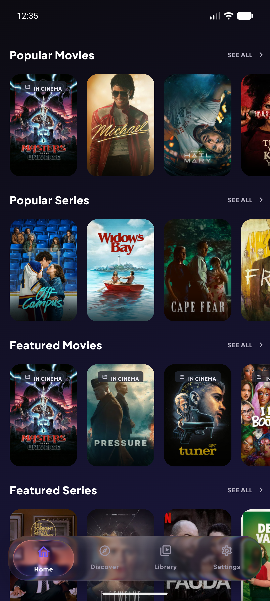

# Stremio Mobile for Android - Kotlin, Jetpack Compose, ExoPlayer and MPV

Native Android client for Stremio built with Kotlin, Jetpack Compose, Kotlin Multiplatform, ExoPlayer, MPV, and a Rust-powered local streaming server.

[](https://github.com/perpetus/stremio-android/actions/workflows/android-ci.yml)
[](https://github.com/perpetus/stremio-android/actions/workflows/release-apk.yml)

> [!WARNING]
> This is a community Android client, not the official Stremio app. It is under active development, with signed APKs, CI builds, and ongoing fixes published in this repository.

## Overview

Stremio Mobile is an open-source Android streaming app focused on bringing a modern native Stremio experience to phones and tablets. It combines the Stremio addon ecosystem with a Compose-first Android UI, local torrent/HTTP streaming, selectable internal players, web-parity subtitle and audio controls, and a configurable Liquid Glass interface.

This repository is useful for developers searching for:

- Stremio Android Kotlin client
- Jetpack Compose streaming app
- Android ExoPlayer and MPV playback backend
- Stremio addon browser for Android
- Kotlin Multiplatform Android media app
- Rust JNI streaming server Android app
- Liquid Glass Android UI components

## Why Use This Instead of the Official App?

This project is built for users who want a transparent, performance-focused Android Stremio experience with more local control than the standard app.

| Area | What this app focuses on |
|---|---|
| **Official Stremio compatibility** | Uses the Stremio core through the Kotlin/JNI core bridge for account, addons, catalogs, library, meta details, streams, player state, and sync behavior. The app replaces the Android interface and local streaming layer, not the Stremio addon ecosystem. |
| **Interface speed** | Native Kotlin/Compose screens with a low-cost Classic UI and configurable Liquid Glass modes, including a Performance mode for lower-end phones. |
| **Streaming performance** | A bundled Rust [`stream-server`](https://github.com/perpetus/stream-server) integrated through JNI for local torrent/HTTP streaming instead of a Node.js-style local server runtime on Android. |
| **Memory use** | The stream-server project documents an approximate `~50MB` memory profile compared with `~200MB+` for Stremio `server.js`, with native Rust performance as the design goal. |
| **Seeking and downloads** | stream-server supports HTTP range requests for instant seeking, HLS transcoding, torrent stats, archive streaming, subtitle extraction, and video probing. |
| **Anime and advanced subtitles** | MPV can be selected as an internal player, with ASS subtitle styling controls, subtitle delay/size/position, local subtitle import, and web-parity subtitle language/variant menus. |
| **Transparency** | The Android app, release workflow, native packaging, MPV wrapper, and streaming server integration are developed in public repositories. GitHub Releases publish signed APKs plus SHA256 checksums. |

The official app is the official support channel. This app is the open-source, native Android alternative for users who want the Stremio core and addon ecosystem behind a faster-moving Android UI, a Rust-powered local streaming engine, selectable ExoPlayer/MPV playback, richer subtitle controls, and APKs that can be inspected from source to release.

## Screenshot

<p align="center">
  
</p>

## Features

- **Native Android UI** built with Kotlin and Jetpack Compose.
- **Stremio core integration** through the Kotlin/JNI core bridge for account, addon, catalog, library, meta, stream, and player state compatibility.
- **Stremio account integration** for synced library, addons, profile settings, and continue watching.
- **Addon discovery and detail pages** for browsing, installing, and managing Stremio addons.
- **Stream selection and playback** for direct HTTP streams and local streaming-server URLs.
- **Dual internal player backends** with ExoPlayer as default and MPV as an optional internal player.
- **Vendored MPV Android library** under `third_party/mpv-android-lib` with supported `armeabi-v7a`, `arm64-v8a`, `x86`, and `x86_64` native outputs.
- **Web-parity audio and subtitle controls** including language defaults, subtitle variants, local subtitle import, styling, delay, size, and position controls.
- **Continue watching resume flow** with remembered stream selection for streams previously played on the device.
- **Modern Liquid Glass interface** with global classic/modern UI style, configurable glass performance mode, adaptive contrast, haptics, sliders, toggles, and a Liquid Glass Lab.
- **Rust local streaming server integration** through JNI for high-performance streaming support.
- **Release APK automation** through GitHub Actions with signed APK publishing and SHA256 checksums.

## Architecture

```text
StremioMobile
|-- app/                              Android app module
|   |-- player/                       Player abstraction, ExoPlayer backend, MPV backend
|   |-- presentation/                 Jetpack Compose screens, Liquid Glass UI, player controls
|   |-- data/                         Repositories and local app preferences
|   |-- server/                       JNI streaming server controller
|   `-- src/main/assets/              Language catalog and app assets
|-- third_party/mpv-android-lib/       Vendored MPV Android library module
|-- streamio-core-kotlin/              Kotlin Multiplatform Stremio core bridge submodule
|-- stream-server/                    Rust streaming server submodule
`-- .github/workflows/                Android CI and release APK workflows
```

### Playback Stack

The app exposes a backend-neutral player API and currently supports:

- **ExoPlayer / Media3** for the default Android-native playback path.
- **MPV** for users who prefer MPV behavior, track handling, and subtitle support.

Player selection is controlled from app settings. Unknown or missing player values fall back to ExoPlayer.

### UI Stack

The app supports two global UI styles:

- **Classic** - lower-cost Material-style interface.
- **Modern (Liquid Glass)** - translucent glass surfaces powered by `com.kyant.backdrop`, adaptive contrast, haptics, and performance modes.

The same global style is respected by settings rows, buttons, cards, toggles, sliders, chips, dropdowns, bottom navigation, and player controls.

## Requirements

- JDK 21
- Android Studio or Android SDK command-line tools
- Android SDK 37
- Android NDK `29.0.13846066`
- Git with submodule support
- Optional for native rebuilds:
  - Rust toolchain
  - `cargo-ndk`
  - vcpkg for Android OpenSSL dependencies

## Clone

```powershell
git clone --recurse-submodules https://github.com/perpetus/stremio-android.git
cd stremio-android
```

If the repository is already cloned:

```powershell
git submodule update --init --recursive
```

## Build

Debug build:

```powershell
.\gradlew :app:assembleDebug
```

Install debug build on a connected Android device or emulator:

```powershell
.\gradlew :app:installDebug
```

Release build:

```powershell
.\gradlew :mpv-android-lib:assembleRelease :app:assembleRelease
```

Release builds produce ABI-specific APKs plus one universal APK:

| APK | Device Target |
|---|---|
| `StremioMobile-vX.Y.Z-armeabi-v7a-release.apk` | Older 32-bit ARM Android devices |
| `StremioMobile-vX.Y.Z-arm64-v8a-release.apk` | Modern Android phones/tablets |
| `StremioMobile-vX.Y.Z-x86-release.apk` | 32-bit x86 emulator |
| `StremioMobile-vX.Y.Z-x86_64-release.apk` | x86_64 emulator |
| `StremioMobile-vX.Y.Z-universal-release.apk` | Fallback APK containing all supported ABIs |

The local release APKs are unsigned unless release signing environment variables are provided.

## Release Signing

The app reads release signing values from Gradle properties or environment variables:

```powershell
$env:ANDROID_KEYSTORE_FILE="C:\Users\you\.android\stremio-mobile-release.jks"
$env:ANDROID_KEYSTORE_PASSWORD="..."
$env:ANDROID_KEY_ALIAS="stremio-mobile-release"
$env:ANDROID_KEY_PASSWORD="..."
```

Then build or install release:

```powershell
.\gradlew :app:assembleRelease
.\gradlew installRelease
```

If the device already has a build signed with a different key, uninstall first:

```powershell
adb uninstall com.stremio.mobile
```

## CI and APK Publishing

GitHub Actions workflows are included:

- `android-ci.yml` builds, verifies, and uploads debug APK artifacts for `armeabi-v7a`, `arm64-v8a`, `x86`, `x86_64`, and universal output.
- `android-pr-checks.yml` validates the Gradle wrapper, compiles debug Kotlin, and runs JVM unit tests for pull requests.
- `android-nightly.yml` builds and uploads scheduled/manual debug APK artifacts for quick smoke testing.
- `android-lint-diagnostics.yml` runs Android Lint manually and uploads reports without blocking the branch while the existing lint backlog is cleaned up.
- `release-apk.yml` builds signed split APKs, generates SHA256 checksums, uploads mapping output, and publishes all assets to GitHub Releases.

Required release secrets:

- `ANDROID_RELEASE_KEYSTORE_BASE64`
- `ANDROID_KEYSTORE_PASSWORD`
- `ANDROID_KEY_ALIAS`
- `ANDROID_KEY_PASSWORD`

To create the base64 keystore secret from PowerShell:

```powershell
[Convert]::ToBase64String([IO.File]::ReadAllBytes($env:ANDROID_KEYSTORE_FILE))
```

## Native Libraries

Prebuilt native outputs are committed for supported ABIs:

- `armeabi-v7a`
- `arm64-v8a`
- `x86`
- `x86_64`

The universal APK contains all supported ABIs. ABI-specific APKs are smaller and should be preferred when the device architecture is known.

The MPV module intentionally excludes `libc++_shared.so` and uses the app-packaged C++ runtime.

Native rebuild helpers:

```powershell
.\gradlew compileNativeLibs
```

MPV native rebuilds are handled separately through:

```bash
third_party/mpv-android-lib/rebuild-native.sh
```

The MPV rebuild script is intended for Linux/macOS environments. stream-server native builds can be run per ABI through the Gradle `copyStreamServerJniLibs` helper; Gradle can run those native ABI tasks in parallel when invoked with `--parallel`.

## Development Notes

- Gradle build cache and configuration cache are enabled.
- ExoPlayer remains the default player backend.
- MPV support is vendored source plus native outputs, not a Maven runtime dependency.
- The app targets Android package `com.stremio.mobile`.
- Supported native ABIs are currently `armeabi-v7a`, `arm64-v8a`, `x86`, and `x86_64`.
- The project is optimized for phone UI. TV/D-pad behavior is not the primary target.

## Useful Commands

```powershell
# Fast Kotlin compile check
.\gradlew :app:compileDebugKotlin

# Debug APK
.\gradlew :app:assembleDebug

# Release APK
.\gradlew :mpv-android-lib:assembleRelease :app:assembleRelease

# Verify release APK metadata contains all ABI split outputs plus universal
python .github/scripts/verify-apk-outputs.py app/build/outputs/apk/release armeabi-v7a arm64-v8a x86 x86_64 universal

# Unit tests
.\gradlew testDebugUnitTest

# List install tasks
.\gradlew tasks --all --console=plain
```

## Repository

- Android app: https://github.com/perpetus/stremio-android
- Stream server: https://github.com/perpetus/stream-server
- Stremio core Kotlin fork: https://github.com/perpetus/stremio-core-kotlin

## Disclaimer

This is an unofficial Android client experiment for Stremio-compatible workflows. It is not a replacement for the official Stremio apps and is provided for testing and development.
